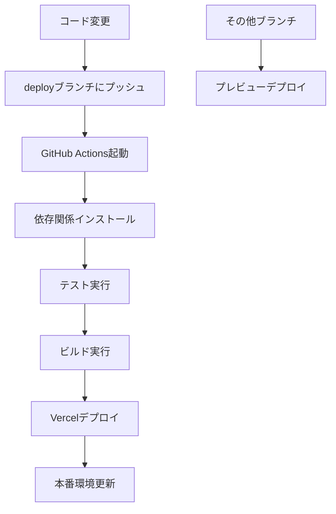

# 🚀 自動デプロイガイド

## 📋 概要

`deploy`ブランチにプッシュされたら自動でVercelにデプロイされる設定を構築しました。

## 🔧 設定内容

### 1. GitHub Actions
- **ファイル**: `.github/workflows/deploy.yml`
- **トリガー**: `deploy`ブランチへのプッシュ
- **処理**: テスト → ビルド → Vercelデプロイ

### 2. Vercel設定
- **ファイル**: `vercel.json`
- **設定**: `deploy`ブランチのみ本番デプロイ
- **その他ブランチ**: プレビューデプロイ

### 3. デプロイスクリプト
- **ファイル**: `scripts/deploy.sh`
- **用途**: ローカルでのデプロイテスト

## 🚀 デプロイ手順

### 方法1: GitHub Actions（推奨）

```bash
# 1. 変更をコミット
git add .
git commit -m "feat: 新機能を追加"

# 2. deployブランチにプッシュ
git push origin deploy

# 3. 自動でデプロイが開始される
# GitHub Actionsで進行状況を確認
```

### 方法2: ローカルデプロイ

```bash
# 1. デプロイスクリプトを実行
./scripts/deploy.sh

# 2. または手動でVercelデプロイ
vercel --prod
```

## 📊 デプロイフロー



## 🔍 監視・確認

### GitHub Actions
- **URL**: `https://github.com/your-org/your-repo/actions`
- **確認項目**: ワークフローの実行状況

### Vercel Dashboard
- **URL**: `https://vercel.com/dashboard`
- **確認項目**: デプロイメント状況

### 本番サイト
- **URL**: `https://your-app.vercel.app`
- **確認項目**: サイトの動作状況

## ⚙️ 環境変数設定

### GitHub Secrets
以下のシークレットをGitHubリポジトリに設定してください：

```bash
VERCEL_TOKEN=your_vercel_token
VERCEL_ORG_ID=your_org_id
VERCEL_PROJECT_ID=your_project_id
```

### Vercel環境変数
Vercelダッシュボードで以下を設定：

```bash
NEXT_PUBLIC_SUPABASE_URL=your_supabase_url
NEXT_PUBLIC_SUPABASE_ANON_KEY=your_supabase_anon_key
SUPABASE_SERVICE_ROLE_KEY=your_service_role_key
OPRF_PRIVATE_KEY=your_oprf_private_key
```

## 🚨 トラブルシューティング

### よくある問題

#### 1. デプロイが失敗する
```bash
# GitHub Actionsログを確認
# エラーメッセージを確認して修正
```

#### 2. 環境変数が設定されていない
```bash
# Vercelダッシュボードで環境変数を確認
# GitHub Secretsでトークンを確認
```

#### 3. ビルドエラー
```bash
# ローカルでビルドテスト
npm run build
# エラーを修正してから再デプロイ
```

### ログの確認方法

#### GitHub Actions
1. リポジトリの「Actions」タブ
2. 失敗したワークフローをクリック
3. ログを確認

#### Vercel
1. Vercelダッシュボード
2. プロジェクトを選択
3. 「Deployments」タブでログを確認

## 🔄 デプロイの管理

### デプロイの停止
```bash
# GitHub Actionsでワークフローをキャンセル
# またはVercelダッシュボードでデプロイを停止
```

### ロールバック
```bash
# Vercelダッシュボードで前のバージョンにロールバック
# またはGitHubで前のコミットに戻す
```

## 📈 最適化のヒント

### デプロイ速度の向上
1. **依存関係のキャッシュ**: GitHub Actionsでキャッシュを活用
2. **並列処理**: フロントエンドとバックエンドを並列ビルド
3. **インクリメンタルビルド**: 変更された部分のみビルド

### セキュリティの向上
1. **シークレット管理**: 適切な権限設定
2. **環境分離**: 本番・ステージング環境の分離
3. **監査ログ**: デプロイ履歴の記録

## 🎯 ベストプラクティス

### デプロイ前のチェック
- [ ] ローカルでテストが通る
- [ ] ビルドが成功する
- [ ] セキュリティチェック完了
- [ ] パフォーマンステスト完了

### デプロイ後の確認
- [ ] サイトが正常に表示される
- [ ] APIが正常に動作する
- [ ] エラーログがない
- [ ] パフォーマンスが良好

---

**注意**: 本番環境へのデプロイは慎重に行い、必ずテスト環境で事前確認を行ってください。
